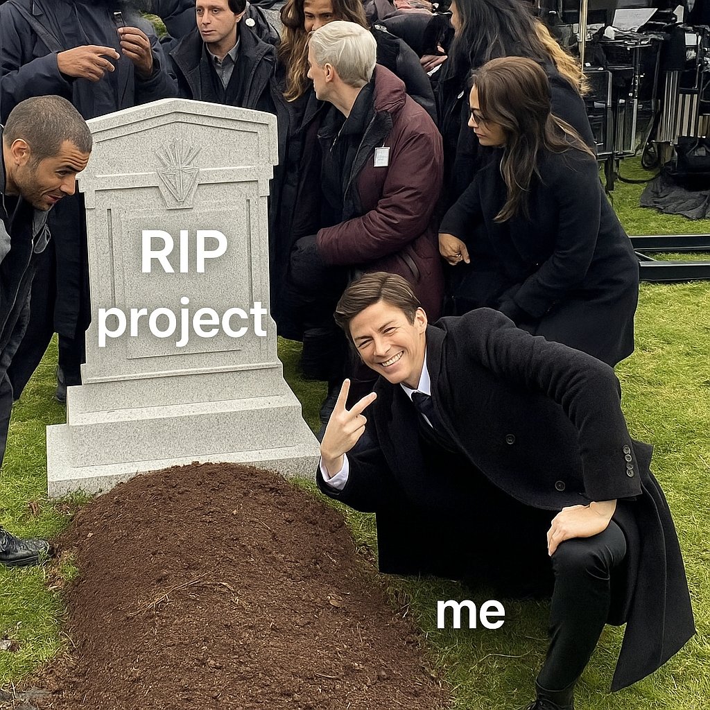

# 🎬 HelloHood (React Frontend) — [DISCONTINUED]

> ⚠️ This project is **discontinued** due to security and scalability considerations.  
> Admin and user-facing functionalities have been moved to separate applications to improve maintainability and performance.

---

## 📌 Notice

This React frontend project previously handled both public and admin functionalities for managing and displaying movie/series data. As the project evolved, we decided to **split it into two separate apps**:

- A **public-facing web app** to browse and filter movies/series.
- A **secured admin panel** to manage content with authentication and role-based access.

The backend has also been refactored into:
- A **public API** (read-only endpoints).
- A **CRM/admin API** (protected write endpoints with authentication).

---

## 📂 Project Overview (before split)

- **Built With:** React, React Router, Bootstrap, Axios, Context API
- **Features:**
  - Home page with filterable movie/series list
  - Details page for individual entries
  - Admin actions: Add, Edit, Delete, Mark as Watched
  - Contact form submission
- **API Source:** Node.js + Express + MongoDB backend

---

## 🛠️ Getting Started (Legacy Setup)

> ⚠️ Use only for reference. This frontend is no longer actively maintained.

```bash
git clone https://github.com/iamvkj26/movie-frontend-app.git
cd movie-frontend-app
npm install
npm run dev

